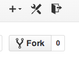

Here are some quick exercises that will help you get a feel for github.  For all of these exercises, you will want your terminal open (Applications --> Utilities --> Terminal).  These instructions are for MAC users.

Exercise 2: Cloning and forking a repository, add and editing files, viewing status and history

Our goal is to create a copy of an existing repo with its commit history.
Generally, there are two ways to do this the general git way and the way within GitHub. 

## `git clone`

In `git` we call copying a repo and its history 'cloning' and use the command `git clone`.
We already used this command in the first exercise to copy a repo from github.com.
It's actually a very general tool and can be used to copy repos from local or remote sources.

First, we'll copy from a local source,  cloning the repo `myrepo` created during the first exercise.
(Assuming you are in the root directory of `myrepo`):

```
cd ..
git clone myrepo myrepocopy
cd myrepocopy
```
Now we are in the new repo. We can create and commit a new file. 

```
touch newfile.txt
git add newfile.txt
git commit -m "Added a new file"
```

We can also edit existing files, for example `README.md`

```
open README.md
# edit in separate app
```

If, at any time, we want to check how much we've changed, use `git status`.
After the small edit to `REAME.md` above, 

`git status`

shows

```
On branch master
Your branch is ahead of 'origin/master' by 1 commit.
  (use "git push" to publish your local commits)

Changes not staged for commit:
  (use "git add <file>..." to update what will be committed)
  (use "git checkout -- <file>..." to discard changes in working directory)

	modified:   README.md

no changes added to commit (use "git add" and/or "git commit -a")
```

now

```
cd ..
```
to get out of this repo.


## GitHub and forking

GitHub calls copying a repo and its history 'forking'.
As opposed to our use of cloning above, forking copies of a repo from someone else's GitHub account to your own.
Because you already have a copy of `myrepo` on your GitHub account, it doesn't make sense (and in fact isn't possible) to fork it yourself.
So, for this exercise, we have created a repo for you to fork.
Don't worry. We will use this repo in future exercises so this isn't wasted effort!

Navigate to [this repo](https://github.com/amandafaig/githubworkshop) on github.com on your web browser.
Make sure you're logged in, and click the fork icon (shown below) in the upper right corner of the page.


After a minute, you will land on a page with your forked copy of the repo.

## Cloning the fork, adding and editing

To use the repo from github.com on your desktop, you must  again use `git clone`.
Back in terminal, type

```
git clone https://github.com/username/githubworkshop.git workshoprepo## change username to yours!
```
which copies the repo from github to a local folder `workshoprepo`. 

Moving into this directory, 
```
cd githubworkshop # your path may differ
```
we can add and edit files as above

```
touch newfile.txt
git add newfile.txt ## git now tracking this file
echo "some content" >> newfile.txt
open README.md
# edit in separate app
```

## Viewing status and history

Now when we type `git status` we see:

```
On branch master
Your branch is up-to-date with 'origin/master'.

Changes to be committed:
  (use "git reset HEAD <file>..." to unstage)

	new file:   newfile.txt

Changes not staged for commit:
  (use "git add <file>..." to update what will be committed)
  (use "git checkout -- <file>..." to discard changes in working directory)

	modified:   README.md
	modified:   newfile.txt

Untracked files not listed (use -u option to show untracked files)
```
This tells us that we've added newfile.txt and modified both newfile.txt and README.md.
Neat.

For more details, we can use another useful new command `git diff`, which in my case shows:

```
diff --git a/README.md b/README.md
index 36abf68..0a1a804 100644
--- a/README.md
+++ b/README.md
@@ -2,3 +2,5 @@ githubworkshop
 ==============

 a repository for workshop participants to do exercises on.
+
+Jaime's local copy
diff --git a/newfile.txt b/newfile.txt
index e69de29..2ef267e 100644
--- a/newfile.txt
+++ b/newfile.txt
@@ -0,0 +1 @@
+some content
```

Finally, to commit all this we can use `git commit` with the `-a` flag to signal commit all modifications to tracked files: 

```
git commit -am "First edits to customize my forked repo"

After all that, to review history, we can use `git log`, which for me shows:

```
commit e7a2b97bf455aa2e79e6c35f868fc5d587eb6ea0
Author: Jaime Ashander <jashander@ucdavis.edu>
Date:   Thu Aug 7 11:47:13 2014 -0700

    First edits to customize my forked repo

commit dde6013247ead264b5ec8ca04559c58233114bcf
Author: Amanda <afaig@ucdavis.edu>
Date:   Thu Aug 7 11:05:50 2014 -0700

    Initial commit
```
